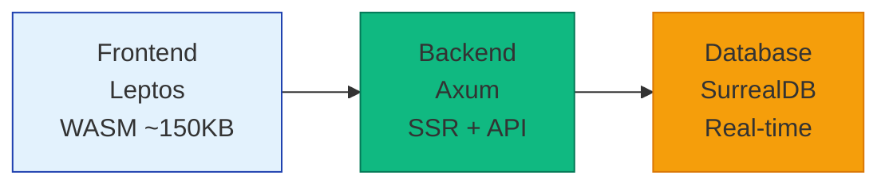

# Blog Engine

[](https://crates.io/crates/blog)
[](https://docs.rs/blog)
[](https://opensource.org/licenses/MIT)
[](https://github.com/athola/blog/actions)
[](https://codecov.io/gh/athola/blog)

**A high-performance Rust blog engine built with Leptos**. This project powers [alexthola.com](https://alexthola.com) and demonstrates full-stack Rust web development with server-side rendering, real-time features, and robust security.

## Quick Start

Get your development environment running in 2 minutes:

```bash
# Clone and setup
git clone https://github.com/athola/blog.git
cd blog
make install-all

# Start development server
make watch
```

Visit `http://127.0.0.1:3007` to see your blog running locally.

## Features

- **Fast Performance** - Server-side rendering achieves ~200ms initial load times
- **Robust Security** - Automated secret scanning and defense-in-depth security strategy
- **Markdown Support** - KaTeX integration for mathematical content rendering
- **Real-time Updates** - Live data synchronization via SurrealDB
- **Responsive Design** - Mobile-first approach with TailwindCSS
- **WASM Frontend** - WebAssembly compilation for optimal browser performance

## Architecture Overview



### Core Components

- **Frontend** - Leptos compiled to WASM (~150KB gzipped) with TailwindCSS
- **Backend** - Axum web server handling both SSR and API requests
- **Database** - SurrealDB 3.0.0-alpha.10 with automatic connection retry
- **Build System** - cargo-leptos for development, cargo-make for automation

## Documentation

- **[Architecture Guide](wiki/Architecture.md)** - Detailed system architecture
- **[Development Workflow](wiki/Development-Workflow.md)** - Local setup and testing
- **[Deployment Guide](DEPLOYMENT.md)** - Production deployment instructions
- **[Security Policy](SECURITY.md)** - Security reporting and policies

## Development

### Prerequisites

- Rust (latest stable) with WASM target: `rustup target add wasm32-unknown-unknown`
- SurrealDB 3.0.0-alpha.10+

### Available Commands

```bash
make watch          # Start development server with live reload
make test            # Run all tests
make validate         # Run formatting, linting, and tests
make build           # Build for production
make lint            # Run code linters
make fmt             # Format code
```

### Testing

Run full test suite:

```bash
make test
```

Run integration tests:

```bash
make test-integration
```

## Tech Stack

- **Framework**: [Leptos](https://leptos.dev/) - Full-stack Rust web framework
- **Database**: [SurrealDB](https://surrealdb.com/) - Modern real-time database
- **Web Server**: [Axum](https://github.com/tokio-rs/axum) - Async web framework
- **CSS**: [TailwindCSS](https://tailwindcss.com/) - Utility-first CSS framework

## Security

This project implements defense-in-depth security:

- **Automated Scanning** - Every commit scanned by Gitleaks, Semgrep and TruffleHog
- **CI Security Gates** - Security failures block deployment
- **Dependency Audits** - Weekly `cargo audit` for CVE detection
- **Secure Defaults** - Secure-by-default configuration

Run security scan manually:

```bash
./scripts/run_secret_scan.sh
```

## Performance

- **First Contentful Paint**: ~200ms
- **WASM Bundle Size**: ~150KB gzipped
- **Database Query Time**: <50ms for typical operations
- **Memory Usage**: <50MB in production

## License

This project is licensed under the MIT License. See the [LICENSE](LICENSE) file for details.