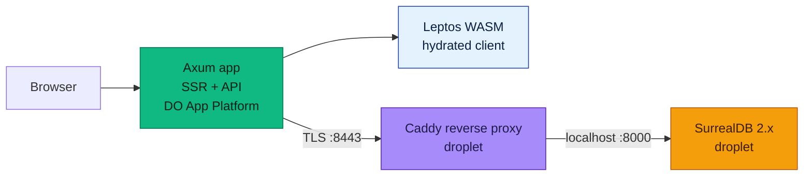

# Blog Engine

[](https://github.com/athola/blog/actions/workflows/rust.yml)
[](https://github.com/athola/blog/actions/workflows/secrets-scan.yml)
[](LICENSE)

**A full-stack Rust blog engine built with Leptos and Axum.** This
project powers [alexthola.com](https://alexthola.com) with server-side
rendering, real-time data via SurrealDB, and automated security scanning
on every commit.

## Table of Contents

- [Quick Start](#quick-start)
- [Features](#features)
- [Architecture](#architecture)
- [Development](#development)
- [Deployment](#deployment)
- [Documentation](#documentation)
- [Tech Stack](#tech-stack)
- [Security](#security)
- [Performance](#performance)
- [Roadmap](#roadmap)
- [Contributing](#contributing)
- [License](#license)

## Quick Start

Get a local development environment running in a couple of minutes:

```bash
git clone https://github.com/athola/blog.git
cd blog
make install-pkgs        # installs cargo-leptos, cargo-make, cargo-audit
make install-surrealdb   # downloads SurrealDB into ~/.surrealdb
make watch               # starts SurrealDB, backend, and live-reload frontend
```

Visit `http://127.0.0.1:3007` to see the blog running locally. Run
`make help` to list every available target.

## Features

- **Server-side rendering** via Leptos + Axum for fast first paint and
  progressive hydration.
- **Real-time data** backed by SurrealDB 2.x with automatic connection
  retry and migrations under `migrations/`.
- **Markdown with math**: KaTeX rendering for technical posts.
- **Editorial design system**: TailwindCSS v4 `@theme` block defines
  every color, typeface, and spacing token in one place. Direction D
  (Dual-Mode Editorial Engineer) — see [`docs/design-system.md`](docs/design-system.md).
- **Light + dark themes** with no FOUC — pre-paint script in `<head>`
  reads `localStorage` then `prefers-color-scheme` before the
  stylesheet loads.
- **Three-family type stack**: Fraunces (display serif), Inter
  (variable sans, custom 470 weight), JetBrains Mono (code + meta).
- **WebAssembly frontend** compiled by `cargo-leptos`; the client bundle
  ships as gzipped WASM.
- **Automated security scanning**: Gitleaks, Semgrep, and TruffleHog
  run on every commit via GitHub Actions.
- **Reproducible deployments**: containerized via `Dockerfile` and
  shipped to DigitalOcean App Platform with Caddy fronting SurrealDB
  (see [Deployment](#deployment)).

## Architecture


```mermaid
graph LR
    U[Browser] --> APP[Axum app<br/>SSR + API<br/>DO App Platform]
    APP --> WASM[Leptos WASM<br/>hydrated client]
    APP -->|TLS :8443| CADDY[Caddy reverse proxy<br/>droplet]
    CADDY -->|localhost :8000| DB[SurrealDB 2.x<br/>droplet]

    style APP fill:#10b981,stroke:#047857,color:#0b1f17
    style WASM fill:#e3f2fd,stroke:#1e40af,color:#0b1f42
    style CADDY fill:#a78bfa,stroke:#5b21b6,color:#1e1b4b
    style DB fill:#f59e0b,stroke:#b45309,color:#3b1d03
```

### Core components

- **`frontend/`**: Leptos client compiled to WASM.
- **`app/`**: shared component library and routing. Routes live at
  `app/src/{home,post,archive,notes,references,about,colophon,contact}.rs`;
  reusable UI lives in `app/src/components/`.
- **`server/`**: Axum application handling SSR, API routes, and
  database access. Includes RSS, Atom, sitemap, raw-markdown, and
  random-stumble handlers in `server/src/utils.rs`.
- **`markdown/`**: Markdown pipeline with KaTeX math support.
- **`shared_utils/`**: cross-crate helpers and types.
- **Build system**: `cargo-leptos` for dev/hot-reload and
  `cargo-make` (`Makefile.toml`) for CI and release orchestration.

### Routes

| Path | Purpose |
|---|---|
| `/` | Home — featured + recent posts + notes strip + tag filter |
| `/post/:slug` | Reading page with in-flow TOC + canonical + JSON-LD |
| `/post/:slug.md` | Raw markdown alternate per post |
| `/archive` | Year-grouped chronological archive (supports `?tag=`) |
| `/notes` | Microblog stream (replaces legacy `/activity`) |
| `/references` | Project portfolio with mono ▰▱ tech-stack bars |
| `/about` | Bio, links, colophon link, JSON-LD Person |
| `/colophon` | Stack, fonts, source, license |
| `/contact` | Contact form |
| `/random` | "Stumble" — 302 to a random published post |
| `/feed/feed.xml` | Atom 1.0 |
| `/feed/rss.xml` | RSS 2.0 |
| `/sitemap.xml` | XML sitemap |

## Development

### Prerequisites

- **Rust** toolchain with the WASM target:
  `rustup target add wasm32-unknown-unknown`.
- **`cargo-leptos`**, **`cargo-make`**, **`cargo-audit`**: installed
  automatically by `make install-pkgs`.
- **SurrealDB 2.6+**: installed via `make install-surrealdb` or from
  [surrealdb.com](https://surrealdb.com/).
- **Node.js**: required only for the TailwindCSS v4 CLI used during
  asset builds; `npm install --silent` pulls `@tailwindcss/cli` and
  `katex` from [`package.json`](package.json).

### Available commands

```bash
# Daily development
make dev             # live-reload frontend + backend (alias: watch)
make all             # build workspace and run tests

# Build
make build           # debug build
make build-release   # production build
make check           # fast type-check without codegen
make clean           # remove build artifacts

# Quality gates
make fmt             # format code
make lint            # clippy with warnings as errors
make validate        # fmt + lint + test + security scan
make test            # run full test suite
make test-ci         # lightweight CI subset
make test-coverage   # cargo-llvm-cov HTML report

# CI pipeline
make ci              # fmt check + lint + test + release build

# Docker (production image)
docker build -t blog .
docker run -p 8080:8080 blog /app/blog
```

Run `make help` for the full list of targets.

## Deployment

Production is deployed to DigitalOcean App Platform with SurrealDB
hosted on a dedicated Droplet. Because App Platform containers cannot
join custom VPCs or reach the SurrealDB port directly, a **Caddy
reverse proxy** on the database droplet terminates TLS on `:8443` and
forwards to SurrealDB at `localhost:8000`. Firewall rules (UFW)
restrict the SurrealDB port to the loopback interface only.

Estimated monthly cost: ~$26 ($12 app, $12 Droplet, $2.40 backups).

See the [Deployment Guide](DEPLOYMENT.md) for the full walkthrough:
cloud-init provisioning, Caddy configuration, App Platform spec,
operational runbooks, and troubleshooting.

## Documentation

- [Architecture](wiki/Architecture.md): component breakdown and data
  flow.
- [API Reference](wiki/API-Reference.md): HTTP endpoints and data
  models.
- [Development Workflow](wiki/Development-Workflow.md): local setup,
  testing, and common `make` targets.
- [Deployment Guide](DEPLOYMENT.md): DigitalOcean + Caddy production
  setup.
- [Security Guide](wiki/Security-Guide.md): hardening practices and
  scanning pipeline.
- [Security Policy](SECURITY.md): vulnerability reporting.
- [Roadmap](PLAN.md): planned features and ordering rationale.

## Tech Stack

- **[Leptos](https://leptos.dev/)**: full-stack Rust framework with
  fine-grained reactivity.
- **[Axum](https://github.com/tokio-rs/axum)**: async web framework
  built on Tokio and Tower.
- **[SurrealDB](https://surrealdb.com/)**: multi-model real-time
  database.
- **[TailwindCSS](https://tailwindcss.com/)**: utility-first styling.
- **[KaTeX](https://katex.org/)**: fast math typesetting for posts.

## Security

Defense-in-depth is applied at commit, CI, and deployment layers:

- **Secret scanning**: Gitleaks, Semgrep, and TruffleHog run on every
  push and weekly via cron (see
  `.github/workflows/secrets-scan.yml`); a positive scan fails the
  job and blocks deployment.
- **Dependency audits**: `cargo audit` runs on every push and PR in
  `.github/workflows/rust.yml` (gated on `Cargo.lock` changes); the
  weekly cron job lives in `secrets-scan.yml`.
- **Hardened defaults**: UFW pins SurrealDB to localhost on the
  database droplet; Caddy terminates TLS on `:8443` and forwards to
  `127.0.0.1:8000`; secrets live in App Platform env vars, never in
  the repo.

Run the local secret scan with:

```bash
./scripts/run_secret_scan.sh
```

To report a vulnerability, follow the disclosure process in
[SECURITY.md](SECURITY.md). **Do not open a public GitHub issue for
security reports.**

## Performance

Measured targets for production (`alexthola.com`):

- **First Contentful Paint**: ~200 ms
- **WASM bundle size**: ~1.6 MB gzipped (8.3 MB raw); `wasm-opt` is
  currently disabled in `frontend/Cargo.toml`, so the artifact is the
  unminified `wasm-release` profile output.
- **Database query latency**: <50 ms for typical operations
- **Memory footprint**: <50 MB resident

These are operational targets rather than guaranteed SLAs; regressions
are flagged by CI integration tests before deploy.

## Roadmap

Planned features and rationale live in [PLAN.md](PLAN.md). Highlights:

- **Q1 2026**: dark/light theme toggle, server-side syntax
  highlighting (likely `syntect`), full-text post search via SurrealDB,
  and related-article suggestions.
- **Q2 2026**: self-hosted comments, lightweight social sharing, and
  a privacy-first newsletter signup.
- **Backlog**: admin interface, PWA offline reading, and experimental
  local AI-assisted tagging.

## Contributing

Contributions are welcome. Please open an issue to discuss proposed
changes before submitting a pull request. Run `make validate` to
verify that formatting, linting, tests, and security scans pass before
pushing.

## License

Licensed under the GNU Affero General Public License v3.0. See
[LICENSE](LICENSE) for the full text.
