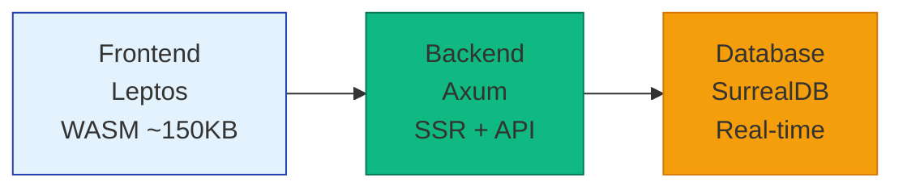

# Blog Engine

[](https://github.com/athola/blog/actions/workflows/rust.yml)
[](LICENSE)

**A full-stack Rust blog engine built with Leptos and Axum.** This project
powers [alexthola.com](https://alexthola.com) with server-side rendering,
real-time data via SurrealDB, and automated security scanning.

## Quick Start

Get your development environment running in 2 minutes:

```bash
# Clone and setup
git clone https://github.com/athola/blog.git
cd blog
make install-pkgs

# Start development server
make watch
```

Visit `http://127.0.0.1:3007` to see your blog running locally.

## Features

- **Fast Performance** - Server-side rendering achieves ~200ms initial load times
- **Automated Security** - Every commit scanned by Gitleaks, Semgrep, and TruffleHog
- **Markdown Support** - KaTeX integration for mathematical content rendering
- **Real-time Updates** - Live data synchronization via SurrealDB
- **Responsive Design** - Mobile-first approach with TailwindCSS
- **WASM Frontend** - WebAssembly compilation, ~150KB gzipped

## Architecture Overview


```mermaid
graph LR
    A[Frontend<br/>Leptos<br/>WASM ~150KB] --> B[Backend<br/>Axum<br/>SSR + API]
    B --> C[Database<br/>SurrealDB<br/>Real-time]

    style A fill:#e3f2fd,stroke:#1e40af
    style B fill:#10b981,stroke:#047857
    style C fill:#f59e0b,stroke:#d97706
```

### Core Components

- **Frontend** - Leptos compiled to WASM (~150KB gzipped) with TailwindCSS
- **Backend** - Axum web server handling both SSR and API requests
- **Database** - SurrealDB 2.x with automatic connection retry
- **Build System** - cargo-leptos for development, cargo-make for automation

## Documentation

- **[Architecture Guide](wiki/Architecture.md)** - Detailed system architecture
- **[API Reference](wiki/API-Reference.md)** - Endpoint and data model reference
- **[Development Workflow](wiki/Development-Workflow.md)** - Local setup and testing
- **[Deployment Guide](DEPLOYMENT.md)** - Production deployment instructions
- **[Security Policy](SECURITY.md)** - Security reporting and policies

## Development

### Prerequisites

- Rust nightly with WASM target: `rustup target add wasm32-unknown-unknown`
- SurrealDB 2.6+

### Available Commands

```bash
# Quick Start
make dev             # Start development server with live reload (alias: watch)
make all             # Build and run tests

# Build
make build           # Build workspace artifacts (debug)
make build-release   # Build for production
make check           # Fast type-check without codegen
make clean           # Remove build artifacts

# Quality
make fmt             # Format code
make lint            # Run clippy with warnings as errors
make validate        # Run full validation (format + lint + test + security)

# Testing
make test            # Run full test suite
make test-ci         # Lightweight CI tests
make test-coverage   # Generate coverage report

# CI Pipeline
make ci              # Full CI: format check, lint, test, build release
```

Run `make help` for a complete list of available targets.

## Tech Stack

- **Framework**: [Leptos](https://leptos.dev/) - Full-stack Rust web framework
- **Database**: [SurrealDB](https://surrealdb.com/) - Modern real-time database
- **Web Server**: [Axum](https://github.com/tokio-rs/axum) - Async web framework
- **CSS**: [TailwindCSS](https://tailwindcss.com/) - Utility-first CSS framework

## Security

This project implements defense-in-depth security:

- **Automated Scanning** - Every commit scanned by Gitleaks, Semgrep and TruffleHog
- **CI Security Gates** - Security failures block deployment
- **Dependency Audits** - Weekly `cargo audit` for CVE detection
- **Secure Defaults** - Secure-by-default configuration

Run security scan manually:

```bash
./scripts/run_secret_scan.sh
```

## Performance

- **First Contentful Paint**: ~200ms
- **WASM Bundle Size**: ~150KB gzipped
- **Database Query Time**: <50ms for typical operations
- **Memory Usage**: <50MB in production

## Roadmap

Planned features are tracked in [PLAN.md](PLAN.md). Highlights:

- **Q1 2026** - Dark/light theme toggle, syntax highlighting, post search, related articles
- **Q2 2026** - Comments, social sharing, newsletter signup
- **Backlog** - Admin interface, offline reading (PWA), AI-powered suggestions

## Contributing

Contributions are welcome. Please open an issue to discuss proposed changes
before submitting a pull request. Run `make validate` to verify formatting,
linting, tests, and security scans pass before pushing.

## License

This project is licensed under the GNU Affero General Public License v3.0.
See the [LICENSE](LICENSE) file for details.