# Alex's Blog

[](https://github.com/athola/blog/actions/workflows/rust.yml)
[](https://codecov.io/gh/athola/blog)
[](https://github.com/athola/blog/blob/master/LICENSE)
[](https://github.com/athola/blog/commits/master)
[](https://www.rust-lang.org)
[](https://crates.io/crates/leptos)
[](#-security-features)
[](https://github.com/zricethezav/gitleaks)
[](https://semgrep.dev)

A modern, secure blog engine built with Rust, Leptos, and SurrealDB, featuring comprehensive CI/CD pipelines and automated security scanning.

## 🚀 Features

- **Full-Stack Rust**: Built with Leptos for SSR/hydration and Axum for the backend
- **Modern Database**: SurrealDB with automatic migrations and retry mechanisms
- **Security-First**: Multi-layer secret scanning and vulnerability detection
- **CI/CD Pipeline**: Automated testing, building, and deployment
- **Performance**: Optimized WASM builds with size monitoring
- **Developer Experience**: Live reload, comprehensive testing, and coverage reports

## 🏗️ Architecture

### Technology Stack
- **Frontend**: Leptos (Rust WASM framework) with Tailwind CSS
- **Backend**: Axum web server with Server-Side Rendering
- **Database**: SurrealDB with automated schema migrations
- **Build System**: cargo-leptos with cargo-make automation
- **Testing**: cargo-nextest with llvm-cov coverage analysis
- **Security**: Gitleaks, Semgrep, and Trufflehog scanning

### Project Structure
```
blog/
├── app/           # Shared Leptos components and API logic
├── server/        # Axum backend with SSR support
├── frontend/      # WASM frontend entry point
├── markdown/      # Markdown processing utilities
├── migrations/    # Database schema and migration files
├── .github/       # CI/CD workflows and automation
└── public/        # Static assets (fonts, images, CSS)
```

## 🔧 Quick Start

### Prerequisites
- Rust (latest stable)
- SurrealDB
- Node.js (for Tailwind CSS)

### Development Setup
```bash
# Install required tools
make install-pkgs

# Start development server (includes database)
make watch
```

The application will be available at `http://127.0.0.1:3007` with live reload on port `3001`.

### Common Commands
```bash
# Development
make watch          # Start dev server with live reload
make build          # Build for development
make build-release  # Build for production

# Testing
make test           # Run all tests with nextest
make test-coverage  # Generate coverage reports
make test-report    # Generate JUnit XML for CI

# Quality Assurance
make lint           # Run clippy linting
make format         # Format Rust code
make security       # Security audit
make outdated       # Check for outdated dependencies
```

## 🔐 Security Features

This project implements comprehensive security scanning as part of its CI/CD pipeline:

### Multi-Layer Secret Detection
- **Gitleaks**: Pattern-based secret detection with custom rules
- **Semgrep**: Static analysis with custom security rules
- **Trufflehog**: Entropy-based secret detection

### Security Configuration Files
- `.gitleaksignore`: Manages false positives with fingerprint-based ignoring
- `.semgrep.yml`: Custom security rules for code analysis
- `.env.example`: Template for secure environment variable setup

### Example Security Scan
```bash
# Run comprehensive security scan
./run_secret_scan.sh

# Results are saved to secret_scanning_results/
# - gitleaks-report.json
# - semgrep-report.json  
# - trufflehog-report.txt
```

**Current Security Status**: ✅ All scans passing - no critical secrets detected

## 🔄 CI/CD Pipeline

The project uses a comprehensive GitHub Actions workflow with security-first design:

### Pipeline Overview

```mermaid
graph LR
    A[🔒 Security Scan] --> B[🦀 Rust Build & Test]
    A --> C[🗄️ Database Migrations]
    B --> D[🚀 Production Deploy]
    C --> D
```


### Workflow Files
1. **`secrets-scan.yml`** - Multi-tool security scanning (blocks on critical findings)
2. **`rust.yml`** - Rust compilation, testing, and coverage analysis
3. **`migrations.yml`** - Database migration validation and testing
4. **`deploy.yml`** - Production deployment (main branch only)
5. **`ci-cd.yml`** - Pipeline orchestration and status reporting

### Security-First Approach
- **Blocks on Secrets**: Critical security issues prevent pipeline progression
- **Comprehensive Coverage**: Scans all file types, not just code
- **Regular Audits**: Weekly scheduled scans + push/PR triggers
- **Audit Trail**: 90-day retention of security scan results

### Testing & Coverage
- **Parallel Testing**: Matrix builds (dev/release profiles)
- **Coverage Reports**: HTML and LCOV formats with Codecov integration  
- **Performance Monitoring**: WASM bundle size checking and benchmarks
- **Quality Gates**: Clippy linting, security audits, and dependency checks

## 🏃‍♂️ Development Workflow

### Adding New Features
1. **Plan**: Use `make test` to ensure starting point is clean
2. **Develop**: Use `make watch` for live development with hot reload
3. **Test**: Write comprehensive tests including retry mechanisms
4. **Secure**: Security scan runs automatically on commit
5. **Deploy**: Automatic deployment on main branch merge

### Testing Strategy
```bash
# Fast development testing
make test

# Comprehensive CI testing  
make test-report        # JUnit XML output
make test-coverage      # LCOV coverage for Codecov
make test-coverage-html # Browse-able HTML coverage

# Specific test suites
make test-retry         # Test retry mechanisms
make test-db           # Database operation tests  
make test-email        # Email functionality tests
make test-server       # Server integration tests
```

### Environment Variables
Copy `.env.example` to `.env` and configure:
```bash
# Database Configuration
DATABASE_URL=ws://127.0.0.1:8000/rpc
DB_NS=blog
DB_DB=blog
DB_USER=root
DB_PASS=root

# API Keys (use secure values in production)
GEMINI_API_KEY=your_gemini_api_key_here
SMTP_HOST=your_smtp_host
SMTP_USER=your_smtp_username  
SMTP_PASSWORD=your_smtp_password
```

**⚠️ Security Note**: Never commit real API keys or passwords. Use `.env.example` for documentation and `.env` (git-ignored) for local development.

## 📊 Performance & Quality

### Build Optimization
- **WASM Size Monitoring**: Automated alerts for bundles >2MB
- **Release Profiles**: Optimized `wasm-release` profile for production
- **Caching Strategy**: Multi-level Rust cache in CI/CD
- **Incremental Builds**: Shared cache keys for faster CI

### Quality Metrics
- **Test Coverage**: Comprehensive workspace coverage with nextest
- **Performance Benchmarks**: Automated benchmark execution when available
- **Dependency Health**: Regular audits for security vulnerabilities and outdated packages
- **Code Quality**: Clippy linting with warnings-as-errors

## 🚀 Production Deployment

### Digital Ocean Integration
The project includes automated deployment to DigitalOcean:

```yaml
# Deployment triggers (main branch only)
- Database migrations applied
- Health checks performed  
- Rollback capability maintained
- Comprehensive monitoring
```

### Production Checklist
- [ ] Environment variables configured
- [ ] Database migrations applied
- [ ] SSL certificates installed
- [ ] Monitoring and alerts setup
- [ ] Backup strategy implemented

## 🤝 Contributing

### Development Environment
1. Fork the repository
2. Create a feature branch: `git checkout -b feature/your-feature`
3. Make changes and ensure tests pass: `make test`
4. Security scan passes: `./run_secret_scan.sh`
5. Submit a pull request

### Code Standards
- **Security**: No secrets in code - use environment variables
- **Testing**: Comprehensive test coverage including retry mechanisms
- **Documentation**: Update relevant documentation files
- **Performance**: Monitor WASM bundle sizes and benchmark results

### Workflow Integration
Pull requests automatically trigger:
- 🔒 Security scanning (Gitleaks, Semgrep, Trufflehog)
- 🦀 Rust compilation and testing (dev + release profiles)
- 📊 Coverage analysis and reporting
- 🔍 Code quality checks (Clippy, audit, dependency analysis)

## 📝 License

This project is licensed under the MIT License - see the [LICENSE](LICENSE) file for details.

## 🔗 Links

- **Live Site**: [alexthola.com](https://alexthola.com) (when deployed)
- **CI/CD Status**: Check GitHub Actions tab for pipeline status
- **Coverage Reports**: Available in workflow artifacts
- **Security Reports**: Generated on each scan in `secret_scanning_results/`

---

**⚡ Built with Rust for speed, security, and consistency**
